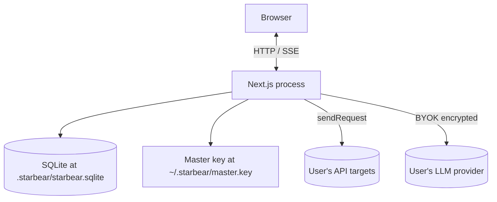

# StarBear — Architecture

How the pieces fit together. This is a working document, not a sales
deck — it describes the code as it is, not the marketing version.

> Last updated: 2026-09-01. Covers Phase 0–10.

---

## 1. System shape

StarBear is a single Next.js 15 monolith. No microservices, no queues,
no separate worker process. One process serves:

- The React 19 frontend (`src/app/**`, `src/components/**`).
- API route handlers (`src/app/api/**`).
- AI agent streaming over SSE (`/api/ai-agent`).
- Static assets (logo, OG image, fonts).



The browser only talks to Next. Next is the only process that reads
the DB or the master key. The browser **never** sees an LLM key in
plaintext.

---

## 2. Code layers

```
src/
├── app/                       ← Next.js App Router
│   ├── api/                   ← Route handlers (server-only)
│   ├── workspace/             ← UI pages (client)
│   ├── page.tsx               ← → redirect('/workspace')
│   └── layout.tsx
│
├── components/                ← Reusable React components (client)
│   ├── ui/                    ← Primitives (button, dialog, tabs, …)
│   ├── shell/                 ← AppShell, Sidebar, Topbar, EnvSwitcher, CommandPalette
│   ├── request-editor/        ← Method, URL, Tabs, KvTable, SaveDialog
│   ├── response-viewer/       ← Status, Body (pretty/raw/preview), Headers
│   └── ai-chat/               ← AgentChat
│
├── lib/                       ← UI-agnostic logic (server + client)
│   ├── http/                  ← sendRequest + SSRF guard + interpolation
│   ├── db/                    ← Repositories + sqlite-shim.cjs
│   ├── ai/                    ← Provider adapters + crypto
│   ├── agent/                 ← Tool descriptors + runtime loop
│   ├── test-engine/           ← Assertion types + runner
│   ├── stores/                ← Zustand client stores
│   └── utils/                 ← nanoid wrapper, cn helper
│
├── scripts/                   ← CLI: migrate, seed, reset, gen-agent-manifest
└── tests/                     ← Vitest unit + integration
```

The split: **`src/lib` knows nothing about React** and is unit-tested
without DOM. **`src/components` knows nothing about the database** and
talks to it only via `fetch('/api/...')`. This keeps each layer
testable and replaceable.

---

## 3. Data model

10 tables, all in one SQLite file.

```
collections ─┐
             ├── requests ──── test_cases ──── test_runs
             │                       │              │
             │                       │              └─ test_run_steps
             │                       └─ (assertions JSON)
             │
environments ─── env_variables
             │
ai_conversations ─── ai_messages
             │
ai_settings        (singleton)
```

Key relationships:

- A **request** belongs to a **collection**; the request carries its
  full method/URL/headers/query/body/auth as raw JSON in TEXT columns
  (we don't try to be clever with normalized child tables — denormalize
  the request blob and search it).
- A **test_case** references a request by id and stores its assertions
  as a JSON string in a `assertions` column.
- A **test_run** is a parent record; its `test_run_steps` child rows
  hold one per executed case. The `summary` column on the run is a JSON
  blob with `{total, passed, failed, errored, duration_ms}`.
- An **ai_conversation** owns many **ai_messages**; messages can carry
  plaintext content or a JSON-stringified `tool_calls` array.
- The **ai_settings** row is a singleton keyed by `id = 'singleton'`.
  It holds the active provider, the per-provider model map, the
  per-provider encrypted key map, and the per-provider base-URL map.

Migrations live in `drizzle/0000_*.sql` (generated by `drizzle-kit`),
and are applied by `scripts/migrate.ts` (executed by `pnpm db:migrate`).
The Drizzle schema in `src/lib/db/schema.ts` is **type-only** — it
exports interfaces, not `sqliteTable` definitions.

---

## 4. The HTTP request pipeline

```
RequestEditor.send()
      │
      │  fetch POST /api/request
      ▼
src/app/api/request/route.ts  (Zod parse + ssrfMode override)
      │
      ▼
src/lib/http/client.ts#sendRequest
      │
      │  1. interpolateDeep(input, vars)        ← {{var}} expansion
      │  2. assertSsrfSafe(url, ssrfMode)       ← IP / scheme check
      │  3. applyAuth(headers, query, auth)
      │  4. undici.request({ method, url, headers, body, bodyTimeout })
      │
      ▼
Response { status, statusText, headers, body, bodyJson, latencyMs, size }
```

**Error model** (all caught in the route handler, mapped to HTTP codes):

| Exception | HTTP | Body |
|-----------|------|------|
| `SsrfBlockedError` | 400 | `{ error: 'ssrf_blocked', reason }` |
| `UnresolvedVariableError` | 400 | `{ error: 'unresolved_variable', name }` |
| `"Request timed out"` | 504 | `{ error: 'timeout', message }` |
| Other | 502 | `{ error: 'upstream', message }` |

### SSRF guard

`assertSsrfSafe(url, mode)` rejects URLs whose host resolves to a
private IP (in either v4 or v6). `strict` mode is the default and
blocks:

- All RFC 1918 ranges (10/8, 172.16/12, 192.168/16)
- Loopback (127/8, ::1)
- Link-local (169.254/16, fe80::/10)
- Carrier-grade NAT (100.64/10)
- Multicast / reserved
- Any non-`http(s):` scheme

`allow-local` is a dev-only escape hatch that permits loopback. The
request editor passes `allow-local` in its body so users can hit
`http://localhost:3000` while developing. Production deployments
should either remove the override or restrict it to a settings flag.

### Interpolation

`interpolateDeep(value, vars)` walks the value recursively. If `value`
is a string, it replaces `{{key}}` with `vars[key]`. If a key is
missing, it throws `UnresolvedVariableError` (mapped to HTTP 400).
Numbers, booleans, and nulls pass through. Arrays and objects are
walked; the result is a deep copy with strings replaced.

---

## 5. The AI agent pipeline

```
AgentChat.send(message)
      │
      │  fetch POST /api/ai-agent (text/event-stream)
      ▼
src/app/api/ai-agent/route.ts
      │
      │  Persist user message → DB
      │  Call runAgent({ ... })
      ▼
src/lib/agent/runtime.ts#runAgent  (async generator)
      │
      │  loop (max MAX_STEPS = 10):
      │    stream = provider.stream({ model, system, messages, tools })
      │    for chunk in stream:
      │      if text      → yield { kind: 'text', text }
      │      if tool-call → yield { kind: 'tool-call', toolCall }
      │    for each toolCall:
      │      result = await executeTool(name, args, ctx)
      │      yield { kind: 'tool-result', toolCall, result }
      │      messages.push({ role: 'tool', content: JSON.stringify({...}) })
      │    if no tool calls → yield { kind: 'finish', reason } return
      │
      ▼
ReadableStream over SSE
      │
      │  Each AgentStep is JSON-encoded as `data: {...}\n\n`
      │  Stream ends with `data: [DONE]\n\n`
      ▼
AgentChat reads chunks, applies events to React state
```

The runtime uses the AI SDK v4 stream API. Each provider adapter
normalizes the SDK's event shapes into a small union:

```ts
type StreamChunk = { type: 'text'; text: string }
                 | { type: 'tool-call'; toolCall: ToolCall }
                 | { type: 'finish'; reason: string };
```

Tool descriptors live in `src/lib/agent/tools.ts` and are auto-exported
to `docs/ai-agent/agent-manifest.json` and `docs/ai-agent/tool-reference.md`
by `scripts/gen-agent-manifest.ts` (run by `pnpm gen:agent-manifest`).
External agents that want to drive StarBear programmatically can read
the manifest.

### The 5 tools

| Name | Args | What it does |
|------|------|--------------|
| `list_collections` | none | Returns `[{ id, name, requestCount }]` |
| `search_requests` | `{ query }` | Substring match on name + URL |
| `send_request` | `{ method, url, headers, body, auth, vars }` | Calls `sendRequest`; respects `ssrfMode` |
| `run_test_case` | `{ testCaseId }` | Calls `runTestCase`; returns outcome |
| `save_request` | `{ collectionId, name, method, url, ... }` | Creates a new request in a collection |

All tools run inside `ToolContext { conversationId, vars, ssrfMode }`.
Vars come from the active environment; ssrfMode defaults to `strict`
unless overridden by the caller.

---

## 6. Crypto

`src/lib/ai/crypto.ts` provides:

- `ensureMasterKey()` — reads or creates `~/.starbear/master.key` (32
  random bytes, base64). The directory is `chmod 700`, the file is
  `chmod 600`.
- `encryptKey(plaintext, masterKey)` — AES-256-GCM with a fresh
  12-byte IV per call. Output is `base64(iv || ciphertext || tag)`.
- `decryptKey(ciphertext, masterKey)` — inverse.

The master key can also be overridden via the `STARBEAR_MASTER_KEY`
env var (base64 of 32 bytes). This is useful for CI and for users who
want to back the key up elsewhere.

We never log the key, never send it to the client, and never include
it in error messages.

---

## 7. Test architecture

`pnpm test` runs 104 tests across two layers:

- **Unit** (`tests/unit/**`): exercise a single function in isolation.
  Examples: `interpolate.test.ts`, `ssrf-guard.test.ts`,
  `runAssertion` for each assertion type, AI provider parsers,
  crypto round-trips, agent runtime loop with a mock provider.
- **Integration** (`tests/integration/**`): spin up the SQLite shim
  with an ephemeral file in `os.tmpdir()`, run the route handler,
  assert on the JSON response. Examples: `api-request.test.ts`,
  `api-collections.test.ts`, `ai-settings.test.ts`.

`pool: 'forks'` is required in `vitest.config.ts` because the CJS shim
that bridges `node:sqlite` doesn't survive the default pool. The
shim itself is in `src/lib/db/sqlite-shim.cjs` and is loaded via
`createRequire`.

Per-test database setup: `process.env.STARBEAR_DB` is set to a fresh
file in `os.tmpdir()`; the test calls `closeDb()` + `migrate()` in
`beforeEach`. This gives every test a clean schema and avoids the
`better-sqlite3` v12's "database is locked" foot-gun.

Coverage thresholds are 80% on `src/lib/**` (see `vitest.config.ts`).
We're currently at 92.8% line coverage, well above the floor.

---

## 8. The UI shell

`/workspace` is wrapped in a single `<AppShell>` that owns the layout:

```
<AppShell right={<AgentChat />}>
  {children}    ← route segment's page
</AppShell>
```

`AppShell` renders the topbar (logo, env switcher, ⌘K, right-pane
toggle) and the sidebar. The right-pane slot is where the AI chat
lives; the store's `rightPaneOpen` boolean controls its width
(`w-80` vs `w-0`).

`useWorkspace` is a Zustand store with two pieces of state:
`rightPaneOpen` and `sidebarCollapsed`. Anything can read or toggle
it; nothing else lives in the store.

The command palette (`⌘K`) is a `cmdk`-backed Radix dialog with a
hard-coded list of navigation targets for now. Future: dynamic
search of collections/requests/environments.

---

## 9. Why these choices

| Choice | Why |
|--------|-----|
| Next.js 15 monolith | One process, one repo, one port. Easier local dev, easier CI. |
| `node:sqlite` | Node 24 ships it; no native build, no Python, no prebuilt-binary network risk. |
| Drizzle schema-as-types | TypeScript inference for repository return values; no `sqliteTable` definition to maintain. |
| Raw SQL in repositories | Fewer abstractions; SQL is already small and auditable. |
| Vercel AI SDK | Streaming + multi-vendor support in one package. |
| BYOK + AES-256-GCM | No server proxy, no telemetry, no per-user state. |
| Radix primitives + custom Tailwind | Accessible defaults (focus, ARIA) without a heavy component lib. |
| No component tests (yet) | Backend logic is fully tested; UI surfaces a thin shell. Tests would add CI cost without catching much. |

---

## 10. Where to extend

- **Add a new assertion type**: edit `src/lib/test-engine/types.ts`,
  add a case in `runAssertion` in `assertions.ts`, add a row in
  the editor in `src/app/workspace/tests/page.tsx`.
- **Add a new tool**: write the executor in `src/lib/agent/tools.ts`,
  add it to `allToolDescriptors`, then run `pnpm gen:agent-manifest`
  to regenerate the manifest.
- **Add a new AI provider**: drop an adapter in `src/lib/ai/providers/`
  matching the `AIProvider` interface, register it in
  `src/lib/ai/providers/index.ts`, add the enum value in
  `src/app/api/settings/ai/route.ts`.
- **Add a new page**: create `src/app/workspace/<name>/page.tsx`,
  add a Sidebar entry in `src/components/shell/sidebar.tsx`,
  add a CommandPalette entry in `src/components/shell/command-palette.tsx`.
- **Add a new API route**: create `src/app/api/<name>/route.ts`,
  re-export repository helpers from `src/lib/db/repositories/*`,
  add an integration test in `tests/integration/`.
